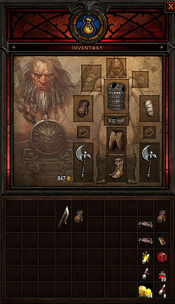

# Diablo 3 Sistema de Inventario JAVA
En este proyecto voy a intentar replicar el sistema de inventario del videojuego Daiblo 3 en Java usando POO.
Diablo 3 es un juego de rol en el que puedes equipar a tu personaje con diferentes armas y armaduras, y dependiendo
de la clase que elijas para tu personaje puedes equiparle solo ciertos tipos de armas y armaduras especificas de su clase.
Para empezar el proyecto voy a empezar solo con 3 clases: Barbaro, Mago y Cazador de demonios y solo implementando armas,
dependiendo de como vea que avanza el proyecto es posible que también añada armaduras.

Para empezar cada arma tiene un sistema de rareza y de estadisticas el cual por ahora no voy a intentar implementar,
es posible que en un futuro intenta calcular cuál seria el daño que hace un ataque dependiendo del arma equipada.
Por ahora me centraré en intentar hacer que un personaje se equipe solo las armas con las que es compatible y que como
máximo se equipe 2 armas. A parte de los tipos de armas tambien hay que destacar que las armas pueden ser de 1 o 2 manos, 
asi que si tienes un arma de 1 mano en la mano derecha podrias equiparte otra en la mano izquierda, pero solo puedes llevar una
si es de 2 manos.

Voy a intentar resolver este sistema de diferentes armas con interfaces, y el inventario lo intentaré crear usando mapas.
A medida que desarrolle el proyecto puede que cree un UML para entenderlo mejor.
